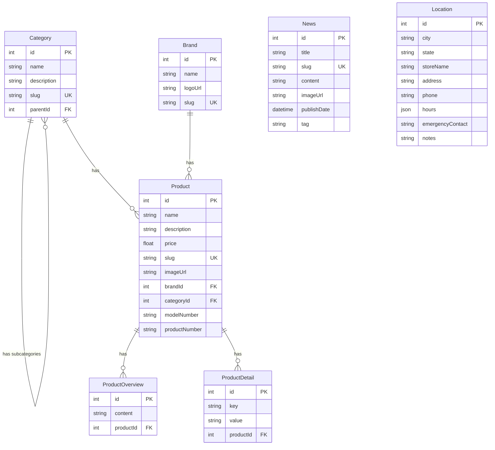

```mermaid
erDiagram
    Category {
        int id PK
        string name
        string description
        string slug UK
        int parentId FK
    }
    
    Brand {
        int id PK
        string name
        string logoUrl
        string slug UK
    }
    
    Product {
        int id PK
        string name
        string description
        float price
        string slug UK
        string imageUrl
        int brandId FK
        int categoryId FK
        string modelNumber
        string productNumber
    }
    
    ProductOverview {
        int id PK
        string content
        int productId FK
    }
    
    ProductDetail {
        int id PK
        string key
        string value
        int productId FK
    }
    
    News {
        int id PK
        string title
        string slug UK
        string content
        string imageUrl
        datetime publishDate
        string tag
    }
    
    Location {
        int id PK
        string city
        string state
        string storeName
        string address
        string phone
        json hours
        string emergencyContact
        string notes
    }
    
    Category ||--o{ Category : "has subcategories"
    Category ||--o{ Product : "has"
    Brand ||--o{ Product : "has"
    Product ||--o{ ProductOverview : "has"
    Product ||--o{ ProductDetail : "has"
```
